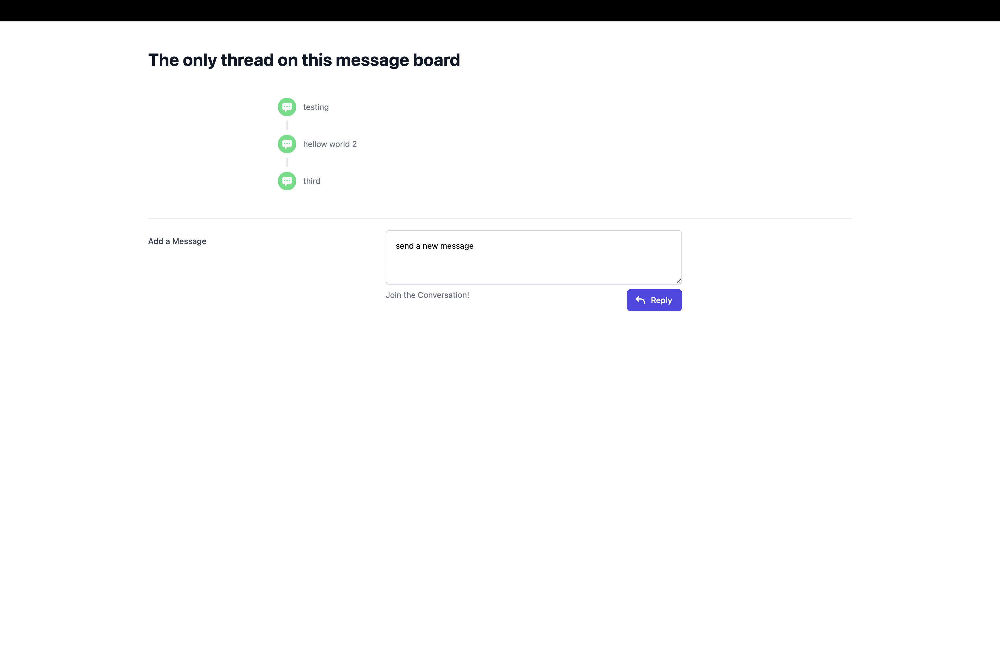

# Getting Started

The workspace is set up as a Cargo workspace with an NPM package in `ui`. The Cargo and NPM projects are entirely contained in their directories otherwise.

To start the dev servers, use the following.

```
cargo run
```

```
cd ui
npm run dev
```

The axum server is hardcoded to port `3001` and the ui server is hardcoded to port `3000`.

Visit `localhost:3000` to see the UI and start submitting messages.



## Testing

The API is the only package with tests at the moment, so running tests is done through cargo.

```
cargo test
```

### Constraints

- use axum
- use typescript
- tests for api routes
- no ui tests required
- in-memory storage (no db)

## Random thoughts on future work

- Messages should live in database some day
- Messages should get ids if we're going to enable functionality like replies. Maybe ksuid/ulid for some bonus inherent ordering.
- Form submission does not yield feedback when submitting
- polling every second is kinda meh as a solution for live updates. If that was a feature then maybe websockets or SSE
- lots of missing functionality: users, avatars, more than one thread on the site, ability to start new threads, reply to specific posts, etc.

---

called development at 2.5h with a working frontend and backend.
